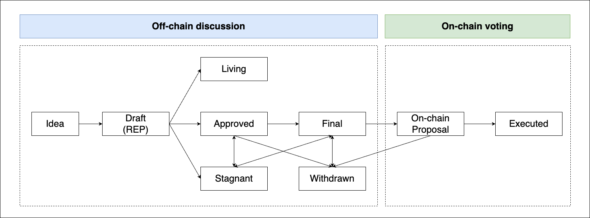

# REP-0001: REP Purpose and Guidelines

## What is REP?

REP stands for Ronin Evolution Proposal. Each REP is a proposal document providing information to the Ronin community. Each REP should provide a concise technical specification of the feature or improvement and its rationale. Each REP’s proposer is responsible for building consensus within the community and documenting dissenting opinions. Each REP has a unique index number. For example this REP is REP-0001.

## REP types

There are three types of REP:

- **Standard**: A Standard REP describes functional changes on Ronin, such as a change to the network protocol, proposer selection mechanism in the consensus algorithm, change in block size, or fee mechanism in the application level. It will affect the implementation of Ronin.
- **Networking**: Networking REPs include improvements around the P2P network. 
- **Process**: This kind of proposal will change the working process of Ronin, like this REP itself.

Currently, all implementations are handled exclusively by the Ronin Core team, a dedicated team within Sky Mavis responsible for research, development, and maintaining the Ronin and Ronin ecosystem. However, we will allow other community members to implement approved proposals in the future.

## REP process

The following is the standardization process for all REPs in all tracks:

- **Idea.** An idea that is pre-draft. This is not tracked within the REPs Repository. You may discuss with the community (on Discord) first before you put too much effort.
- **Draft.** This is the first stage of a REP in its development process. To ensure the feasibility of the draft, the authors are encouraged to engage in discussions with the Ronin Core team. Before merging into the REPs repository and obtaining a REP number, a draft undergoes a comprehensive review conducted by the Ronin Core team.
- **Off-chain Voting.** Once the draft is ready, the authors will make a public announcement to the community. If there is no pushback, the off-chain voting process will begin. 
- **Approved.** A draft is approved under the following conditions: 
1) more than 50% of validators (Governing and Standard) approve; and 
2) less than 25% of validators reject.

- **Final.** Ronin Core team put the approved draft into the developing phase, if the core team successfully implemented and tested the idea, it can be marked as final.
- **On-chain Voting.** The implementation of the REP has been deployed and an on-chain proposal is created. 
- **Executed.**  The on-chain proposal is approved by more than 75% of the governing validators. The implementation will take effect once it is approved.

Other exceptional statuses include:

- **Living.** A special status for REPs that are designed to be continually updated and not reach a state of finality. This includes most notably REP-0001.
- **Stagnant.** A REP has not been updated for more than 6 months, it will enter Stagnant state.
- **Withdrawn.** A REP that is dropped and will not be implemented or a REP that is deployed on chain but get rejected.

## REP format

Each REP should have the following parts:

- Preamble - A header containing metadata about the REP, including the REP number, a short descriptive title, a description, and the author's details.
- Abstract - Abstract is a short paragraph technical summary. This should be a very terse and human-readable version of the specification section. Someone should be able to read only the abstract to get the gist of what this specification does.
- Rationale - The rationale fleshes out the specification by describing what motivated the design and why particular design decisions were made. It should describe alternate designs that were considered and related work, e.g. how the feature is supported in other languages. The rationale should discuss important objections or concerns raised during the discussion around the REP.
- Specification - The technical specification should describe the syntax and semantics of any new proposal. The specification should be detailed enough to allow competing, interoperable implementations for any of the current Ronin platforms.
- Backward Compatibility *(optional)* - All REPs that introduce backward incompatibilities must include a section describing these incompatibilities and their consequences. This section may be omitted if the proposal does not introduce any backward incompatibilities, but this section must be included if backward incompatibilities exist.
- Test Cases *(optional)* - Test cases for implementation are mandatory for REPs that are affecting consensus changes. Tests should either be inlined in the REP as data (such as input/expected output pairs). 
- Reference Implementation (*optional*) - An optional section that contains a reference implementation of the proposal.
- Security analysis - A section that discusses the security analysis of the proposal. 
- Economic analysis (*optional*) - An optional section that discusses how the proposal will effect the ecosystem of Ronin. 
##  Reference

Bitcoin Improvement Proposals:  <https://github.com/bitcoin/bips>

Ethereum Improvement Proposals:  [https://github.com/ethereum/EIPs](https://github.com/ethereum/EIPs/blob/master/EIPS/eip-1.md)

BNB Evolution Proposals:  [https://github.com/bnb-chain/BEPs](https://github.com/bnb-chain/BEPs/blob/master/BEP1.md)

