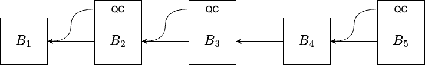

# REP-0003: Optimistic Fast Finality

## Preamble
<pre>
REP-0003
Title: Optimistic Fast Finality
Author: Ronin Core Team
Type: Standards Track
Status: Draft
Created: 2023-07-10
</pre>

## Abstract

This REP proposes a new fast finality mechanism that aims to increase the speed of transaction confirmation on Ronin. The proposed mechanism is expected to significantly reduce the time it takes for transactions to be confirmed on Ronin, which will help to improve the user experience and make Ronin more competitive in the market. 

## Rationale

Finality is critical for blockchain security, once the block is finalized, it would not be reverted anymore. The fast finality feature is very useful, users can make sure they get accurate information from the latest finalized block, then they can decide what to do next instantly. 

Currently, to confirm a transaction on Ronin, the users need to wait for 15 blocks (~45s). With the new fast finality mechanism, optimistically, they only need to wait for 2 blocks (~6s) to confirm a transaction. 

# Specification

We propose a voting mechanism to enable optimistic fast finality. 

### Voting rules

Validators confirm a block's validity by providing their signatures on the block's hash. If a block receives enough votes, the validators can create a quorum certificate (QC) to attest to the block's validity. The block's QC is included in its direct child block.

Validators vote according to the following rules:

- **Rule 1:** A validator must not publish two distinct votes for the same height.
- **Rule 2:** A validator always votes for the latest block of its best chain.
- **Rule 3**: A validator only votes for the block with a bigger block height than its previous vote.

### Vote aggregation

Once the validators vote for a block, the next block producer collects those votes and creates a Quorum Certificate (QC) if there are more than $k$ votes for the block. In Ronin's case, with $n=22$ validators, we set $k = \lfloor 2n/3\rfloor+1 = 15$. The QC of a block will be stored in the block header of its direct child. If the validators cannot collect enough votes before the next block is generated, the QC will not be generated.

The QC will be verified by other nodes in the network. A block containing an invalid QC will be considered invalid. To optimize the size and verification time of QCs, we use the [BLS signature scheme](https://github.com/supranational/blst). The BLS signature allows us to aggregate the signatures of validators on a block into a single signature. Compared to unaggregated signatures, the aggregated signature can save up to $n$ times the space. Additionally, we can verify the QC of validators with a single signature verification operation.

### Finality rules

Finalizing a block involves two steps: justification and finalization.

- A block is considered justified if its QC is included in the block header of its direct child.
- A block is considered finalized if it is justified and its direct descendant (in the same epoch) is also justified.

In the figure above, block $B_1,B_2,B_4$ are justified as their QCs are included in block $B_2,B_3,B_5$, respectively. 
Here, only block $B_1$ is finalized. 

### Best chain selection

In Ronin, validators use the sum of the difficulty field to compare and confirm which chain is the best ancestor to pick. This finality mechanism requires the chain to grow under a new fork choice rule.

- The chain that includes the highest justified block is considered the best chain, even if there are other chains with a higher total difficulty.
- If multiple chains include the highest justified block, the chain with the highest total difficulty is selected as the best chain.

### Rewards

At most 1% of the block rewards (including transaction fees and staking rewards) will be distributed to the validators who vote to finalize blocks. Note that, these rewards will not be distributed to the delegators. 

The rewards will be distributed in every period to the validators based on their votes. 

- Let $n_1$ be the number of blocks in the period and $n_2$ be the number of blocks where the QC is included. Let $r$ be the total rewards in the period. The total rewards for all validators for finalizing blocks are $1\%\times r\times n_2/n_1$.
- For every QC that is included in a block, the reward weight of the block producer increases by 2 and the reward weights of the remaining validators, who have their vote included in the QC, increase by 1. The reward of a validator in a period will be proportional her/his reward weight.

### Slash

The validator who violates Rule 1 will get slashed. 

- The evidence can be submitted by anyone, whenever someone sees the malicious behavior.
- The malicious validator will get slashed for 250,000 RON and will be put in jail for $2^{63}-1$ blocks (same as double-sign slash).

## Security analysis

A secure consensus protocol must satisfy two properties: safety and liveness. In addition, we will analyze a new property called fast finality.
- **Safety**. If a block is finalized, it cannot be reverted, i.e., two blocks in different forks cannot be finalized.
- **Liveness**. New blocks will be added to the chain after some certain time.
- **Fast finality**. A block will be finalized after 2 blocks.

### Safety

If at least $k = \lfloor 2n/3\rfloor+1$ validators are honest, then two blocks in different forks cannot both be finalized.

First, we show that two blocks $a_i$ and $b_i$ (which are in different forks and at the same block height) cannot both be justified. Assume toward contradiction that $a_i$ and $b_i$ are both justified. In this scenario, there are at least $k$ validators who vote for $a_i$ and $k$ validators who vote for $b_i$. Since the number of malicious validators is at most $n-k$, there are at least $2k-n$ honest validators who vote for $a_i$ and at least $2k-n$ honest validators who vote for $b_i$. Therefore, the total number of votes from honest validators for $a_i$ and $b_i$ is at least $4k-2n > k$. However, since honest validators can only vote for at most one block at a given block height, this case cannot occur.

Next, we show that blocks $a_i$ (at block height $i$) and $b_j$ (at block height $j$), which are in different forks, cannot be finalized. Assume, for the sake of contradiction, that two blocks $a_i$ and $b_j$ are in different forks and are both finalized. Without loss of generality, assume $i < j$. Let $a_{i+1}$  be the direct descendant block of $a_i$. As $a_i$ is finalized, $a_{i+1}$ is justified. Since two blocks at the same block height cannot be both justified, we have $i+1 < j$.

As $a_{i+1}$ is justified, there are at least $2k-n$ honest validators who vote for $a_{i+1}$ (as a justified block needs at least $k$ votes). In the views of those validators, the highest justified block will be $a_i$. Those validators have not voted for block $b_j$ (based on Rule 2). Plus, based on Rule 3, they will not vote for any blocks that are not descendants of block $a_i$, which includes $b_j$. Therefore, there are at most $2 n - 2 k < k$ validators who vote for $b_j$. Hence, block $b_j$ cannot be justified, leading to a contradiction.

### Liveness and fast finality

If at least $\lfloor n/2\rfloor+1$ validators are honest and online, they are able to continue producing blocks.

When there are at least $k = \lfloor 2n/3\rfloor+1$ honest validators, and all votes from the honest validators are received within 3 seconds (the block time) by the next validator, then every block will be justified after 1 block. Consequently, every block will be finalized after 2 blocks.

## Economic analysis

We will demonstrate that block producers should include all votes in their QC to maximize profits. A rational validator may intentionally exclude the votes of certain validators in an effort to reduce the reward weight of those validators and increase its own rewards. However, if a rational validator does this, the excluded validators may retaliate by also excluding the votes of the rational validator. Ultimately, the rational validator will receive fewer rewards.
