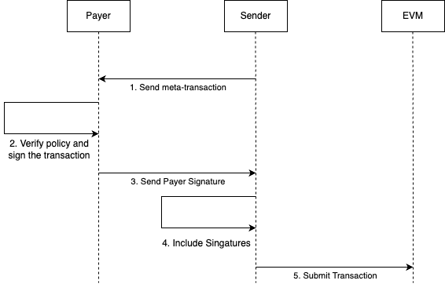

# REP-0008: Sponsoring transaction

## Preamble
<pre>
REP-0008
Title: Sponsoring transaction
Author: Ronin Core Team
Type: Standard Track
Status: Draft
Created: 2023-11-02
</pre>

## Abstract

We create a new transaction type that supports sponsored transactions by an optional additional signature from which the account that will pay for gas.

## Rationale

In our ongoing mission to support Web3 game studios, we have identified gas sponsorship as a crucial feature. Through this proposal, we aim to empower game studios to sponsor gas costs for their users.
For instance:

- Game studios will have the capability to sponsor a set number of transactions for each of their users.
- A quest system can provide users with redeemable codes that can cover transaction fees.

This enhancement not only streamlines the user experience but also fosters greater engagement within the Web3 gaming community.

## Specification

### A new transaction type

A new REP-0007 transaction is introduced with `TransactionType=0x64`. 

The `TransactionPayload` for this transaction is `(chainId, nonce, max_priority_fee_per_gas, max_fee_per_gas, gas_limit, destination, amount, data,ExpiredTime, payerSignature, senderSignature)`.

- `ExpiredTime`: The transaction is valid if it is included in a block whose `timestamp` is less than or equal to this value.
- `payerSignature` is the signature of the payer over `(chainId, sender, nonce, max_priority_fee_per_gas, max_fee_per_gas, gas_limit, destination, amount, data,ExpiredTime)`. The payer is the address whose RON balance is deducted to pay for gas.
- `senderSignature` is the signature of the payer over `(chainId, nonce, max_priority_fee_per_gas, max_fee_per_gas, gas_limit, destination, amount, data,ExpiredTime, payerSignature)`. The sender is the address 
    - returned by the `CALLER` (aka `msg.sender`) opcode during the first call frame of the transaction
    - returned by the `ORIGIN` opcode (aka `tx.origin`)
    - whose RON balance is deducted if any value is attached to the transaction
- We include `max_priority_fee_per_gas, max_fee_per_gas` in case that we impelement EIP-1559 on Ronin. For now, those two fields have the same value and serve as the gas price. 

### Sponsoring transaction flow

The flow of a sponsoring transaction is as follows.

- The Sender generates the meta-transaction (i.e., all the fields exclude the Sender signature) to the Payer, alongside the Sender’s address. 
- The Payer then verifies if the transaction satisfies its sponsoring policies. If yes, the Payer generates the signature and forwards it to the Sender.
- The Sender then includes the Payer signature to the transaction, signs it and submits the transaction. 

## Security analysis

As the user is the last person to sign and submit a transaction, we can minimize the attack of a malicious payer.  

## License

The content is licensed under [CC0](https://creativecommons.org/publicdomain/zero/1.0/).