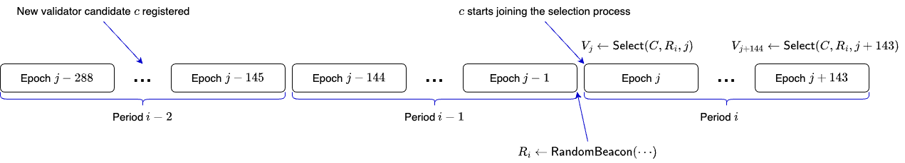
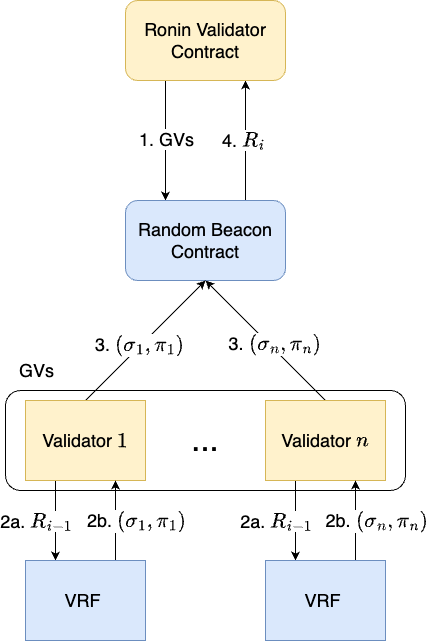

# REP-0010: Introducing Rotating Validators

## Preamble
<pre>
REP-0010
Title: Introducing Rotating Validators
Author: Ronin Core Team
Type: Standards Track
Status: Draft
Created: 2024-1-5
</pre>

## Abstract

This REP aims to enhance the decentralization and resilience of Ronin by introducing an additional set of validators, called "Rotating Validators". The Rotating Validators will play a role in block production, albeit with a lower frequency compared to the existing validators. It is crucial to uphold a substantial motivational factor to ensure that potential validators are not only inclined to guarantee the platform's integrity but also actively contribute to Ronin's security.

## Rationale

Currently, Ronin is operated by 22 active validators, alongside numerous inactive validators. These inactive validators do not yield any rewards, leading to a lack of adequate motivation for node operators to uphold node quality. Moreover, the current requirement for validators is exceptionally high. As of this writing, it requires 7.7 million RON (approximately $15 million) to become a standard validator. To improve the network's decentralization, a crucial step involves the incorporation of additional validators. 

## Specification

### Overview

In the current design, 22 validators are selected daily to perform two main tasks: producing blocks and voting for finality. The validator is updated every day based on the staked amount. Note that only these chosen validators are entitled to receive rewards as a part of their duties. The rest of the validators who couldn't make it to the chosen list do not receive any rewards.

In the new design, the tasks of block production and finality voting are separated. In each epoch (~10 minutes), 22 validators are randomly selected to produce blocks. All validators, however, can vote for finality.

Below is the overview of how block producers are selected in every epoch. 

- For each period (~1 day), the validators jointly compute a random beacon.
- The random beacon in period $i-1$ will be used to select the validators in period $i$.
    - In each epoch, 12 Governing Validators, $p$ Standard Validators, and $q$ Rotating Validators are selected (here, $p+q=10$).
    - Governing Validators and Standard Validators are selected as the current design.
    - Rotating Validators are randomly selected based on the random beacon.
- For each epoch of period $i$, a set of validators is selected based on the random beacon in period $i-1$ and the epoch number.

**Note that:** The newly joined validator candidate needs to wait an extra day to participate in the selection process. 

### Compute random beacon

The random beacon is computed by the Governing Validators in every period using a verifiable random function. 

A verifiable random function (VRF) is a public-key pseudorandom function that provides proofs of its output's correct calculation. The owner of the secret key can compute the function value and an associated proof for any input value. Everyone else, using the proof and the associated public key, can check that this value was indeed calculated correctly. However, this information cannot be used to find the secret key.

The process of computing the random beacon for period $i$, executed in period $i-1$ consists of 4 steps.

- Step 1: At the begining of epoch $i-2$, the Ronin Validator Contract sends the set of Governing Validators to the Random Beacon Contract. At the same time, the Random Beacon Contract sends the random beacon $R_{i-1}$ to the Ronin Validator Contract (this is Step 4 in the previous period).
- Step 2: Each Governing Validator $j$ queries its VRF worker using the random beacon $R_{i-1}$ and obtains the output $\sigma_j$ and the proof $\pi_j$.
- Step 3: Each Governing Validator $j$ submits the output $\sigma_j$ and the proof $\pi_j$ to the Random Beacon Contract (via a system transaction).
    - If a validator does not submit the output and proof in 3 consecutive periods, it will get slashed 1,000 RON.
- Step 4: At the last epoch of period $i-1$, the Random Beacon Contract computes the random beacon $R_i$ and sends it to the Ronin Validator Contract.
    - $R_i$ is computed as the hash value of
        - All outputs of governing validators
    - The random seed is the output of VRF with the input as the concatenate of the random beacon of the previous period and the current period number.

### Obtain Rotating Validators

In each epoch, 12 Governing Validators, $p$ Standard Validators, and $q$ Rotating Validators are selected ( $p+q=10$). The Rotating Validators are selected as follows. 

- Let $R_i$ be the random beacon in period $i$.
- For validator $v$, let $s_v$ be the staked amount of $v$ and $adr_v$ be the admin address of $v$.
- Let $t$ be the current epoch number.
- Let $w_v = H(R_i\|t\|adr_v)\cdot \sqrt{s_v}$, where $H$ is a hash function (SHA256).
- The top $q$ validators with the highest value of $w_v$ will be selected.

### ****Vote for finality****

All validators have the ability to vote for finality. The weight of their votes is directly proportional to the staked amount. We also adjust the rule of voting for finality as follows. 

- For each block, the block producer creates a QC if the total staked of voted validators is more than 2/3 of the total staked amount of all validators. The rules for justifying and finalizing blocks remain the same.
- The reward for finality voting is increased to 50%-90% of the block rewards. The rewards are now shared between validators and delegators.
- The finality rewards of validators are proportional to the finality score.
    - For each block, all validators receive $g/h$ finality score, where $g$ is the total staked of voted validators and $h$ is the the total staked of all validators. Each voted validator receives a finality score that is proportional to their staked amount.

## Security analysis

The random beacon must satisfy the following properties to achieve security.

### Unpredictability

The random beacon must be unpredictable, meaning that an attacker should not be able to guess or compute the random beacon. Otherwise, the attacker can register new Validator Candidates, with carefully chosen admin addresses to maximize their chance of getting selected as Rotating Validators. 

In our design, as the random seeds of GVs cannot be predicted until they are published on the blockchain, the random beacon of period $i$ cannot be predicted before period $i-1$. Note that, the newly joined Validator Candidate needs to wait an extra period to participate in the selection process. Thus, when a Validator Candidate registers, they do not know about the random beacon that will be used when they start to participate. 

### **Unbiasability**

The random beacon should be unbiased, meaning that no individual or group should be able to influence the random beacon to their advantage. In our case, we allow for a small amount of bias, but only within a specified bound.

As the Governing Validators are carefully chosen, they always submit valid random seeds, thus the random beacon is unbiased. Even though the Governing Validators go rogue, they cannot submit invalid random seeds as we can verify the VRF output. 

### **Public verifiability**

The random beacon should be publicly verifiable, meaning that anyone should be able to verify that the numbers are truly random and have not been tampered with.

In our design, the random beacon is computed based on the VRF output of GVs. Thus, everyone can verify it. This design choice ensures that the verification process is not only possible but straightforward and accessible. As a result, every participant in our system, or even an external observer can verify the random beacon.

## Economic analysis

## License

The content is licensed under [CC0](https://creativecommons.org/publicdomain/zero/1.0/).